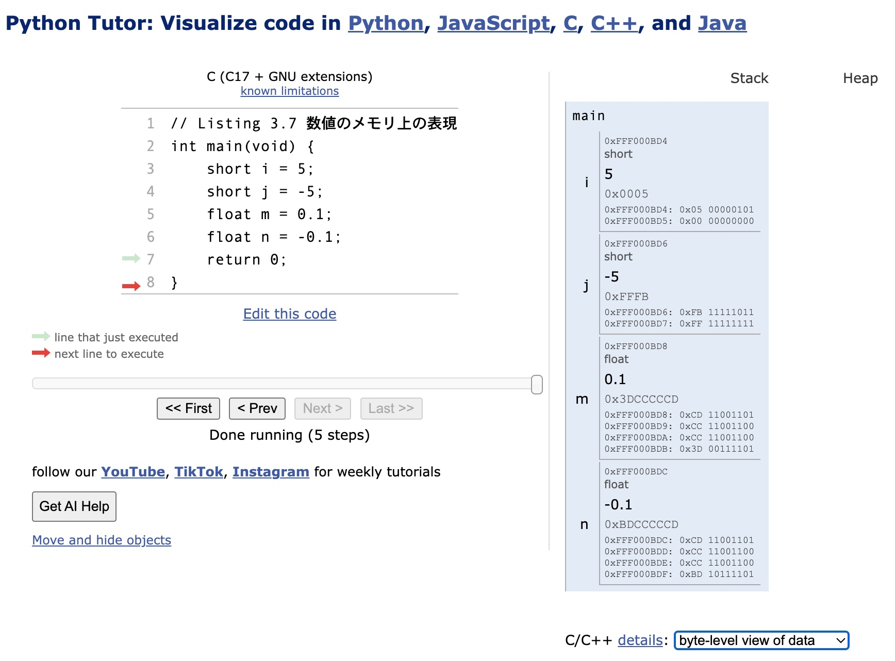

# Listing 3.7 数値のメモリ上の表現
Python TutorにListing 3.7(c3-7.c)のコードを入力し確認する。

* サイト画面でCを選択した後に、Listing 3.7のコードを入力する
* **Visualize Execution**ボタンを押す
* コンパイルエラーがなければステップ実行画面に遷移するのでLast>>ボタンを押す
* メモリの状態が右側に表示される
* プルダウンメニューで**byte-level view of data**を選択する
* 下図の表示になる

