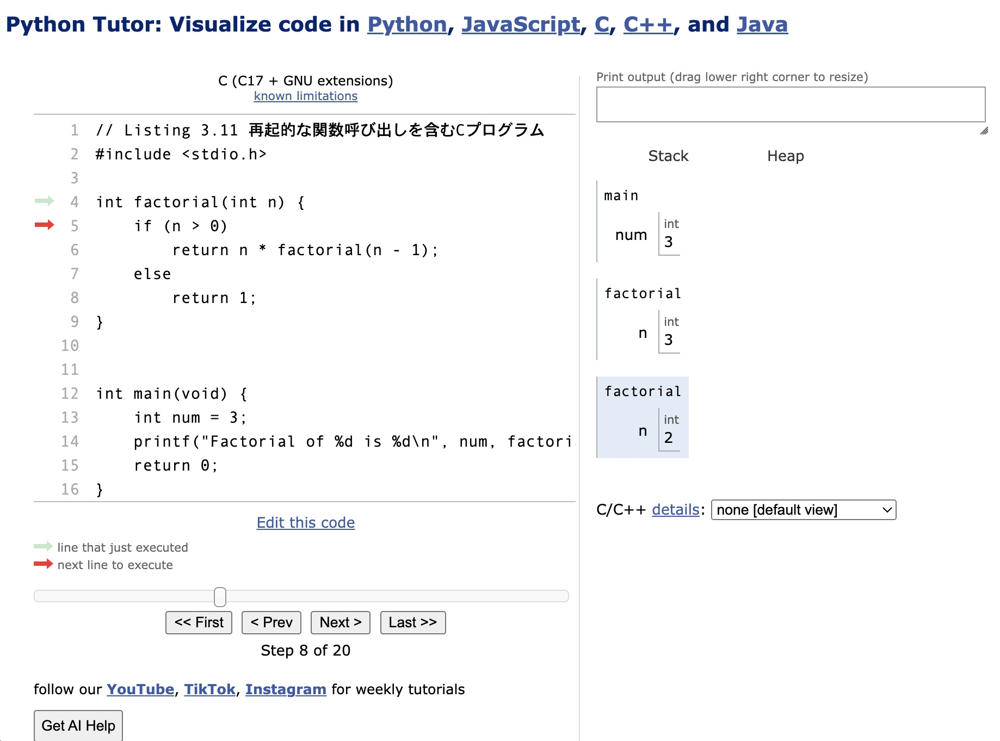
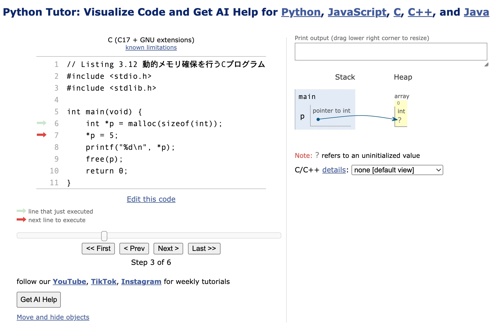
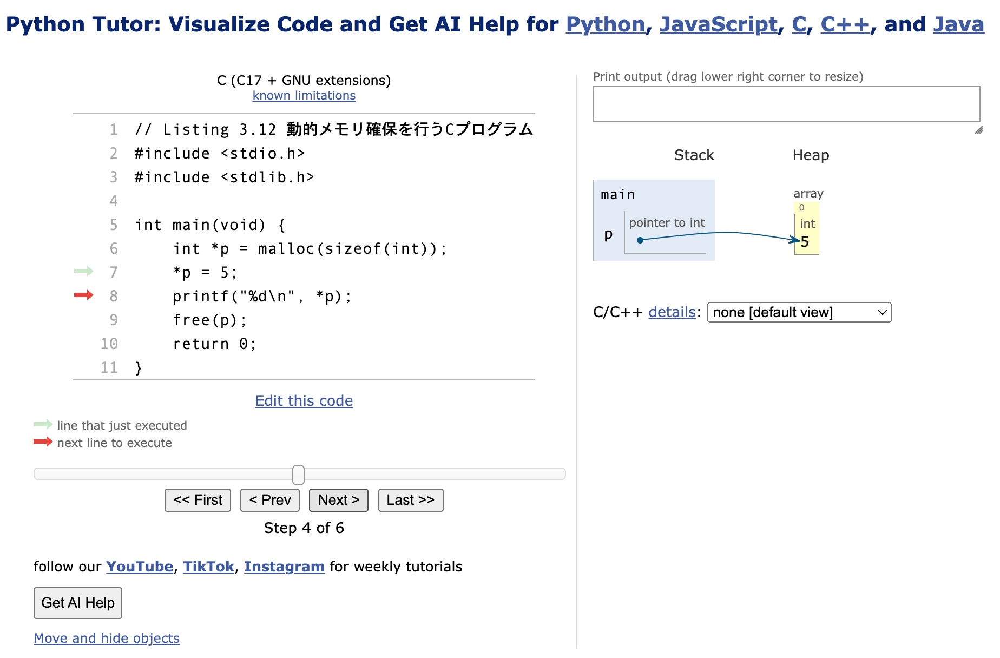

# Listing 3.7 数値のメモリ上の表現
[Python Tutor](https://pythontutor.com/)にListing 3.7(c3-7.c)のコードを入力し確認する。

* サイト画面でCを選択した後に、Listing 3.7のコードを入力する
* **Visualize Execution**ボタンを押す
* コンパイルエラーがなければステップ実行画面に遷移するのでLast>>ボタンを押す
* メモリの状態が右側に表示される
* プルダウンメニューで**byte-level view of data**を選択する
* 下図の表示になる

# Listing 3.11 再起的な関数呼び出しを含むCプログラム

* 再帰的に関数が呼び出されると、スタック領域には関数呼び出しの情報が積み重なっていく

# Listing 3.12 動的メモリ確保を行うCプログラム

* mallocした後

* mallocしたアドレスに代入した後

* printfした後(Print outputに数値が表示されている)

* freeした後(💀のアイコンになっている)

